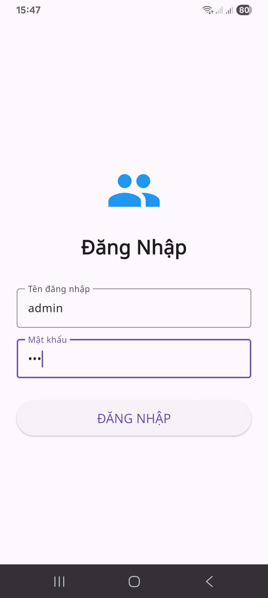
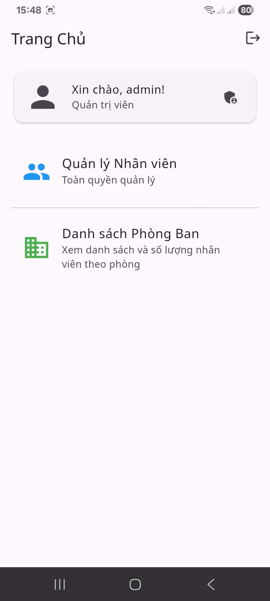
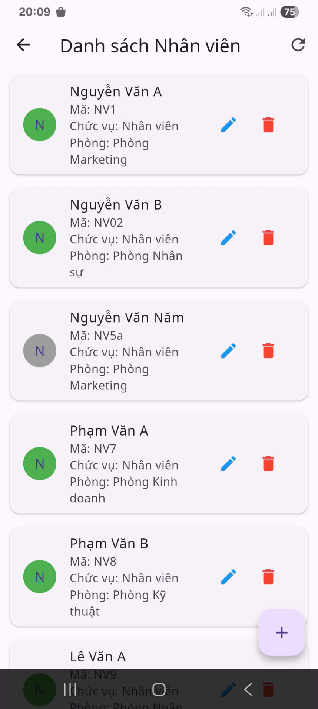
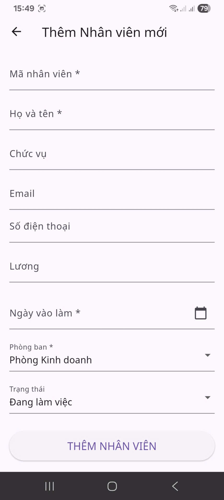
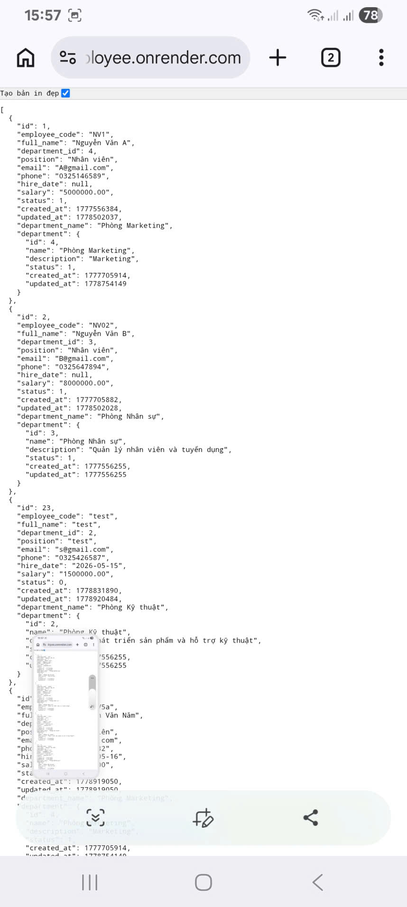
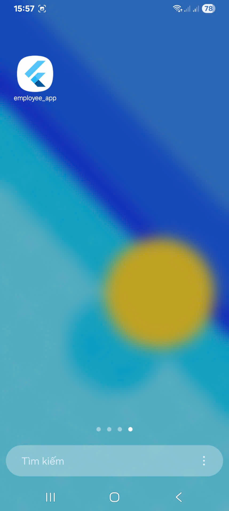

# Employee Management Flutter App

Ứng dụng Flutter quản lý nhân viên và phòng ban, kết nối với Yii2 REST API được deploy trên Render và sử dụng MySQL cloud Aiven.

## Backend API

```txt
https://yii2-flutter-employee.onrender.com
```

## Test Account

### Admin

```txt
username: admin
password: 123
```

### User

```txt
username: user
password: 123
```

## Tech Stack

- Flutter
- Dart
- REST API
- HTTP package
- Yii2 Backend API
- Render
- Aiven MySQL

## Main Features

### Authentication

- Login with username and password
- Logout

### Employee Management

- View employee list
- Create employee
- Update employee
- Delete employee
- Select department
- Select hire date with DatePicker
- Employee status management

### Department Management

- View department list
- Create department
- Update department
- Delete department
- Department status management

### Validation

- Required fields validation
- Email format validation
- Phone number validation
- Salary validation
- Date validation

- ---

## Screenshots

### Login Screen



### Home Screen



### Employee List



### Employee Form



### Department List


### API Response



### APK Release



---

## System Architecture

```txt
Flutter Mobile App
        ↓
Yii2 REST API on Render
        ↓
Aiven MySQL Cloud Database
```

## API Base URL

```dart
static const String baseUrl = 'https://yii2-flutter-employee.onrender.com';
```

## Required Android Permission

```xml
<uses-permission android:name="android.permission.INTERNET" />
```

## Run Project

```bash
flutter clean
flutter pub get
flutter run
```

## Build APK

```bash
flutter build apk --release
```

APK output:

```txt
build/app/outputs/flutter-apk/app-release.apk
```

## Release APK

APK release can be uploaded in GitHub Releases.

Suggested tag:

```txt
v1.0.0
```

## Notes

Because the backend uses free cloud services, the first request may take a few seconds if Render or Aiven is sleeping.

## Related Backend Repository

```txt
https://github.com/QuangDuy770/yii2-flutter-employee
```

## Author

Phạm Quang Duy

GitHub: https://github.com/QuangDuy770
